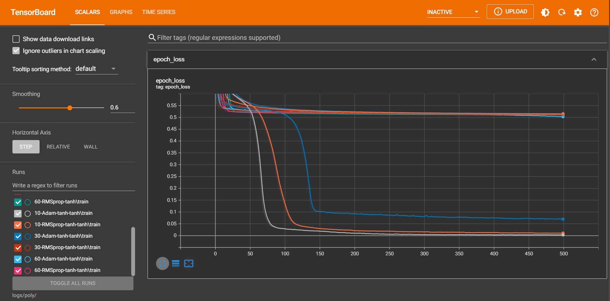

# Funciones y ecuaciones diferenciales
## Funciones
En todos los experimentos se utilizaron los valores epochs=500, loss=*mean absolute error* (*mae*), learning_rate=1e-3, optimizer=[Adam, RMSprop] y una reducción del learning rate hasta un mínimo de 1e-4.
### Inciso a)
Las imagenes resultantes de los experimentos se encuentran en *img/sin*, los modelos correspondientes en *models/sin* y los logs correspondientes para inicializar tensorboard en *logs/sin*.

Los mejores 3 modelos fueron:
- 30-Adam-tanh-tanh: 30 neuronas en cada capa, dos capas *tanh* y una *linear* de salida, optimizador Adam y error 0.00708.
- 10-Adam-tanh-tanh: 10 neuronas en cada capa, dos capas *tanh* y una *linear* de salida, optimizador Adam y error 0.01211.
- 60-Adam-tanh-tanh: 60 neuronas en cada capa, dos capas *tanh* y una *linear* de salida, optimizador Adam y error 0.01664.

### Inciso b)
Las imagenes resultantes de los experimentos se encuentran en *img/poly*, los modelos correspondientes en *models/poly* y los logs correspondientes para inicializar tensorboard en *logs/poly*.

Los mejores 3 modelos fueron:
- 10-Adam-tanh-tanh: 10 neuronas en cada capa, dos capas *tanh* y una *linear* de salida, optimizador Adam y error 0.0031929.
- 10-RMSprop-tanh-tanh: 10 neuronas en cada capa, dos capas *tanh* y una *linear* de salida, optimizador RMSprop y error 0.01011.
- 30-Adam-tanh-tanh: 30 neuronas en cada capa, dos capas *tanh* y una *linear* de salida, optimizador Adam y error 0.06955.

### Nota
Las imagenes resultantes de los experimentos se encuentran en *img/sin_poly*, los modelos correspondientes en *models/sin_poly* y los logs correspondientes para inicializar tensorboard en *logs/sin_poly*.

Los mejores 3 modelos fueron:
- 30-Adam-tanh-tanh: 30 neuronas en cada capa, dos capas *tanh* y una *linear* de salida, optimizador Adam y error 0.0062013.
- 60-Adam-tanh-tanh: 60 neuronas en cada capa, dos capas *tanh* y una *linear* de salida, optimizador Adam y error 0.0063135.
- 10-Adam-tanh-tanh: 10 neuronas en cada capa, dos capas *tanh* y una *linear* de salida, optimizador Adam y error 0.01829.

## Ecuaciones diferenciales
En todos los experimentos se utilizaron los valores epochs=500, learning_rate=1e-3, optimizer=[Adam, RMSprop] y una reducción del learning rate hasta un mínimo de 1e-4.
### Inciso a)
Las imagenes resultantes de los experimentos se encuentran en *img/ode_a*, los modelos correspondientes en *models/ode_a* y los logs correspondientes para inicializar tensorboard en *logs/ode_a*.

Los mejores 3 modelos fueron:
- 30-RMSprop-tanh-relu-tanh: 30 neuronas en cada capa, una capa *tanh* de entrada, una *relu* y una *tanh* escondidas y una *linear* de salida, optimizador RMSprop y loss 0.06749.
- 60-RMSprop-tanh-relu-tanh: 60 neuronas en cada capa, una capa *tanh* de entrada, una *relu* y una *tanh* escondidas y una *linear* de salida, optimizador RMSprop y loss 0.117.
- 30-Adam-tanh-relu-tanh: 30 neuronas en cada capa, una capa *tanh* de entrada, una *relu* y una *tanh* escondidas y una *linear* de salida, optimizador Adam y loss 0.2183.

### Inciso b)
Las imagenes resultantes de los experimentos se encuentran en *img/ode_b*, los modelos correspondientes en *models/ode_b* y los logs correspondientes para inicializar tensorboard en *logs/ode_b*.

Los mejores 3 modelos fueron:
- 30-Adam-tanh-tanh: 30 neuronas en cada capa, dos capas *tanh* y una *linear* de salida, optimizador Adam y error 0.000069357.
- 60-Adam-tanh-tanh: 60 neuronas en cada capa, dos capas *tanh* y una *linear* de salida, optimizador Adam y error 0.00041195.
- 10-Adam-tanh-tanh: 10 neuronas en cada capa, dos capas *tanh* y una *linear* de salida, optimizador Adam y error 0.00029885.